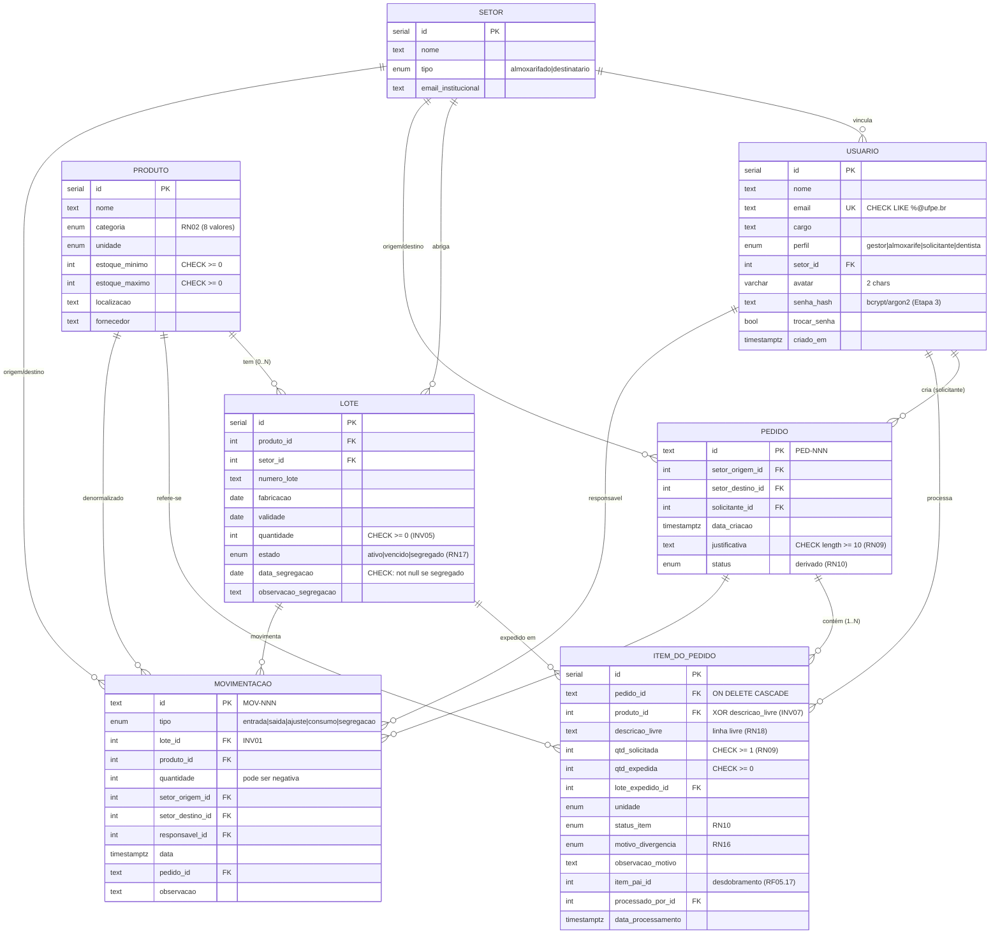

# Diagrama Entidade-Relacionamento (E-R) — Schema físico v2

**Documento:** 04-diagrama-er
**Última atualização:** 02/06/2026
**Origem:** derivado de `03-modelo-conceitual.md` (v2) e implementado em
`projeto/backend/src/db/schema.ts` (Drizzle ORM — ver ADR-0004).
**Fecha:** SCRUM-10 (modelagem do banco + diagrama E-R).

> Este é o modelo **físico** (tabelas, colunas, FKs, enums) tal como está no
> Postgres. O modelo **conceitual** continua em `03-modelo-conceitual.md`.
> Invariantes INV01–INV09 e regras RN02/RN09/RN16/RN17 estão materializados como
> enums, FKs, UNIQUE e CHECK constraints (ver `schema.ts` e a migration em
> `projeto/backend/drizzle/`).

## Diagrama (mermaid)



## Invariantes refletidos no schema físico

| Invariante / Regra | Como está no banco |
|--------------------|--------------------|
| INV01 — toda Movimentação referencia um Lote | `movimentacao.lote_id` FK NOT NULL |
| INV04 — Lote referencia Produto e exatamente um Setor | `lote.produto_id` + `lote.setor_id` FKs NOT NULL |
| INV05 — quantidade do Lote sempre ≥ 0 | CHECK `lote_quantidade_nao_negativa` |
| INV06 — Usuário tem um perfil e um setor | `usuario.perfil` enum NOT NULL + `setor_id` FK NOT NULL |
| INV07 — ItemDoPedido tem produto_id XOR descricao_livre | CHECK `item_produto_xor_descricao` |
| RN02 — catálogo fechado de categorias | enum `categoria` (8 valores) |
| RN09 — justificativa ≥ 10 / qtd_solicitada ≥ 1 | CHECK `pedido_justificativa_minima` / `item_qtd_solicitada_minima` |
| RN17 — lote segregado tem data de segregação | CHECK `lote_segregado_tem_data` |
| RN01/RNF03 — e-mail institucional | CHECK `usuario_email_ufpe` (LIKE `%@ufpe.br`) + UNIQUE |

## Invariantes que NÃO são constraints (ficam em código)

Dependem de estado calculado em runtime e ficam nas funções de domínio
(Etapa 2) e nos services, não no schema:

- **INV02 / INV03** — completude de campos ao processar um item (lote_expedido,
  qtd_expedida, processado_por, motivo de divergência). Validado no service de
  processamento de pedido.
- **INV08** — lote vencido/segregado não pode ser `lote_expedido` (FEFO, RN20).
- **INV09** — expedição p/ CEO gera 2 movimentações + cria/atualiza lote-CEO (RN19).
- **RN03–RN07** — `qtd_total` e status agregado do produto (soma de lotes ativos).
- **RN10** — status derivado do pedido a partir dos itens.
```
