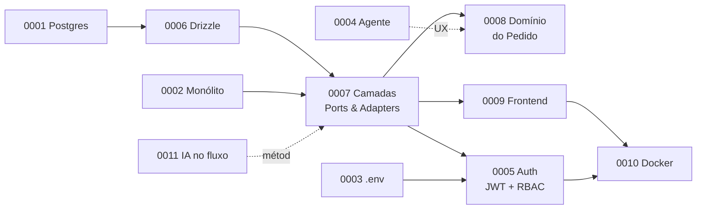

# Decisões Arquiteturais (ADRs)

Um **ADR** (*Architecture Decision Record*) registra uma decisão arquitetural
relevante: o **contexto** que a motivou, a **decisão** tomada, as **alternativas
consideradas** e rejeitadas, e as **consequências** (incluindo os trade-offs
negativos assumidos). Documentar isso preserva, para quem vier depois, *por que*
o sistema é como é — não só *o que* ele faz.

Os ADRs 0001–0004 foram escritos no momento de cada decisão. Os ADRs 0005–0011
**consolidam decisões que já estavam implementadas no código** mas não tinham
registro formal — uma dívida de documentação que esta entrega quitou. A autoria
de cada um foi atribuída ao responsável real pela área, inferida do histórico Git
(canonicalizado via `.mailmap`).

## Índice

| ADR | Decisão | Camada | Status |
|-----|---------|--------|:------:|
| [0001](ADR-0001.md) | **PostgreSQL** como banco relacional | Dados | Aceito |
| [0002](ADR-0002.md) | **Arquitetura monolítica** | Macro | Aceito |
| [0003](ADR-0003.md) | **Configuração via `.env`** (dotenv) | Infra | Aceito |
| [0004](ADR-0004.md) | **Agente de e-mail** (IMAP + LLM) para ingestão de pedidos | Produto/UX | Proposto |
| [0005](ADR-0005.md) | **Autenticação JWT** (stateless) + **RBAC** perfil×setor | Segurança | Aceito |
| [0006](ADR-0006.md) | **Drizzle ORM** sobre o driver `pg` | Dados | Aceito |
| [0007](ADR-0007.md) | **Camadas + Ports & Adapters** + Injeção de Dependência | Estrutura | Aceito |
| [0008](ADR-0008.md) | **Pedido cabeçalho + N itens** com status **derivado** (RN10) | Domínio | Aceito |
| [0009](ADR-0009.md) | **Frontend SPA** React + Vite (Context API) | UI | Aceito |
| [0010](ADR-0010.md) | **Docker Compose** (4 containers) sob subcaminho Nginx | Deploy | Aceito |
| [0011](ADR-0011.md) | **IA como ferramenta** de engenharia/gestão | Processo | Aceito |

## Como ler em ordem

As decisões contam uma história **de dentro para fora**:

- **Dados** (0001 Postgres → 0006 Drizzle) — onde e como os dados moram.
- **Estrutura** (0002 Monólito → 0007 Camadas) — como o código é organizado.
- **Domínio** (0008) — o coração da regra de negócio, em funções puras testáveis.
- **Segurança** (0005) — quem é o usuário e o que pode fazer.
- **Interface & Deploy** (0009 → 0010) — como o usuário acessa e como publicamos.
- **Produto/UX** (0004) e **Processo** (0011) — o agente de e-mail como decisão de
  experiência, e o uso transparente de IA como ferramenta.

!!! tip "Rastreabilidade"
    Cada ADR técnico aponta para o **código real** que o implementa (arquivo e,
    quando útil, a função). Por exemplo, o [ADR-0008](ADR-0008.md) ancora-se em
    `domain/pedido.ts` — a função pura `statusDerivadoDoPedido` que deriva o
    status do pedido a partir dos seus itens.
