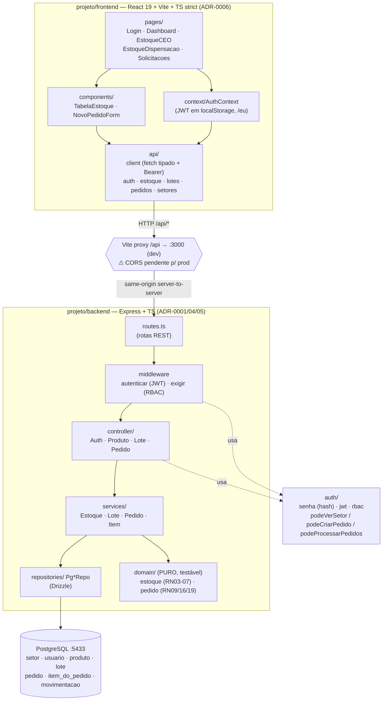
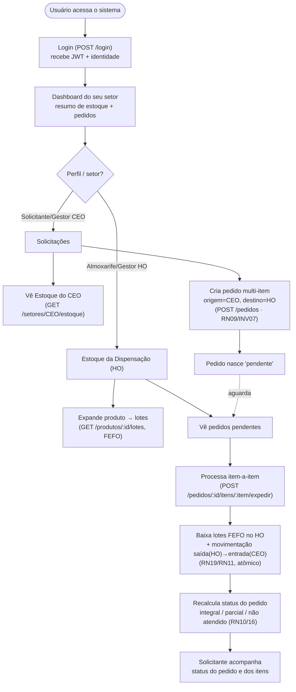

# Visão geral — arquitetura e fluxos (CEO-UFPE)

> Gerado em 2026-06-03. Reflete `feat/fundacao-backend` (PR #20, backend v2) + `feat/frontend-fundacao` (PR #21, front).
> Modelo de dados = **v2 Drizzle** (ADR-0004). As branches `develop` / `feature/database-schema` (modelo v1-v2 paralelo) estão **superseded** — não usar como base.

## 1. Arquitetura do código

Monólito em duas pastas (`projeto/backend`, `projeto/frontend`), camadas explícitas, banco PostgreSQL.

**Princípios:** o `domain/` é puro (sem I/O) e concentra as regras de negócio (RN); `services/` orquestram repos + domínio em transações atômicas (estoque + auditoria nunca divergem); `controller/` só traduz HTTP; RBAC por perfil×setor. O front espelha os enums do backend em `types/domain.ts` (sync manual — futura melhoria: pacote compartilhado).

## 2. Fluxos dos usuários

Dois setores: **HO** (almoxarifado central, `almoxarifado`) e **CEO** (clínica, `destinatario`). Perfis: gestor, almoxarife, solicitante, dentista.

**Orientação do pedido (importante):** ORIGEM = setor de quem pede (CEO); DESTINO = HO (quem fornece). A expedição move o estoque fisicamente HO → CEO. (Bug corrigido na validação e2e — o front enviava invertido.)

## 3. Estado de integração (2026-06-03)

- **PR #20** (`feat/fundacao-backend` → main): backend v2 + EP02/03/04 + `GET /setores` + fix `seq_pedido`. Base oficial.
- **PR #21** (`feat/frontend-fundacao` → base no #20): front (4 telas), front-only. **Mergear #20 primeiro.**
- Base de integração decidida: **`main`**; `develop` aposentada.
