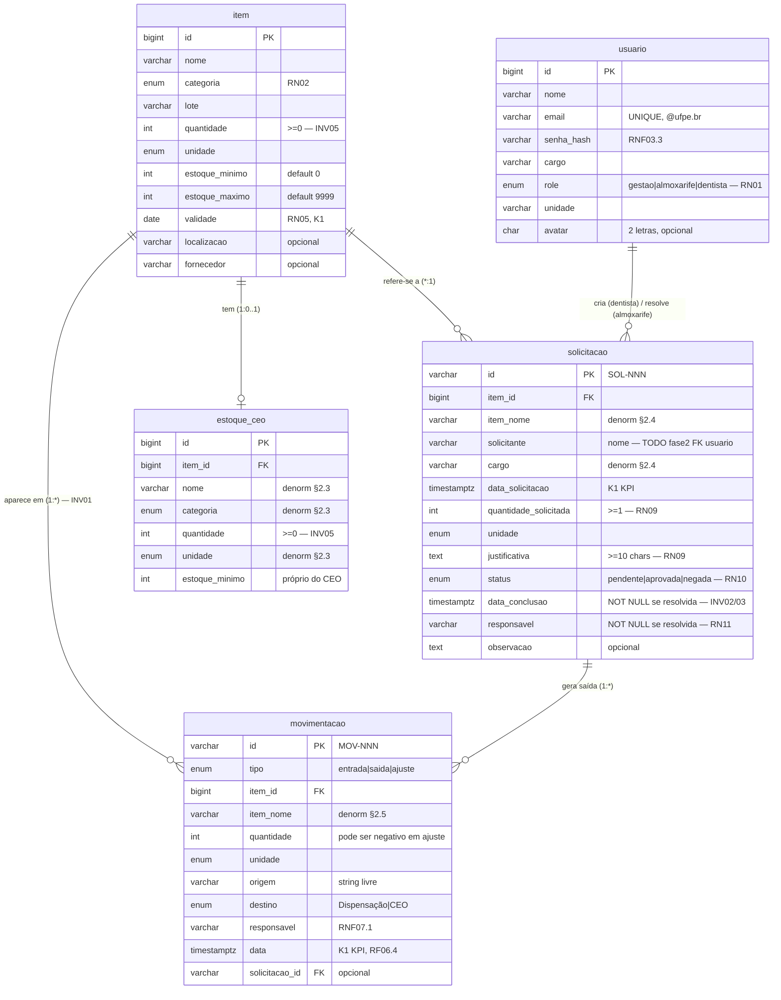

# DER — CEO Estoque UFPE (Mermaid)

> Renderiza inline no GitHub/GitLab e pode ser importado no Draw.io via **Insert → Advanced → Mermaid**.

```mermaid
erDiagram

  usuario {
    bigint   id          PK
    varchar  nome
    varchar  email       "UNIQUE, @ufpe.br"
    varchar  senha_hash  "RNF03.3"
    varchar  cargo
    enum     role        "gestao|almoxarife|dentista — RN01"
    varchar  unidade
    char     avatar      "2 letras, opcional"
  }

  item {
    bigint  id             PK
    varchar nome
    enum    categoria      "RN02"
    varchar lote
    int     quantidade     ">=0 — INV05"
    enum    unidade
    int     estoque_minimo "default 0"
    int     estoque_maximo "default 9999"
    date    validade       "RN05, K1"
    varchar localizacao    "opcional"
    varchar fornecedor     "opcional"
  }

  estoque_ceo {
    bigint  id             PK
    bigint  item_id        FK
    varchar nome           "denorm §2.3"
    enum    categoria      "denorm §2.3"
    int     quantidade     ">=0 — INV05"
    enum    unidade        "denorm §2.3"
    int     estoque_minimo "próprio do CEO"
  }

  solicitacao {
    varchar    id                    PK  "SOL-NNN"
    bigint     item_id               FK
    varchar    item_nome             "denorm §2.4"
    varchar    solicitante           "nome — TODO fase2 FK usuario"
    varchar    cargo                 "denorm §2.4"
    timestamptz data_solicitacao     "K1 KPI"
    int        quantidade_solicitada ">=1 — RN09"
    enum       unidade
    text       justificativa         ">=10 chars — RN09"
    enum       status                "pendente|aprovada|negada — RN10"
    timestamptz data_conclusao       "NOT NULL se resolvida — INV02/03"
    varchar    responsavel           "NOT NULL se resolvida — RN11"
    text       observacao            "opcional"
  }

  movimentacao {
    varchar     id             PK  "MOV-NNN"
    enum        tipo           "entrada|saida|ajuste"
    bigint      item_id        FK
    varchar     item_nome      "denorm §2.5"
    int         quantidade     "pode ser negativo em ajuste"
    enum        unidade
    varchar     origem         "string livre"
    enum        destino        "Dispensação|CEO"
    varchar     responsavel    "RNF07.1"
    timestamptz data           "K1 KPI, RF06.4"
    varchar     solicitacao_id FK "opcional"
  }

  %% §3 Relacionamentos — cardinalidades do modelo conceitual
  usuario       ||--o{ solicitacao   : "cria (dentista) / resolve (almoxarife)"
  item          ||--o{ solicitacao   : "refere-se a (*:1)"
  item          ||--o| estoque_ceo   : "tem (1:0..1)"
  item          ||--o{ movimentacao  : "aparece em (1:*) — INV01"
  solicitacao   ||--o{ movimentacao  : "gera saída (1:*)"
```
