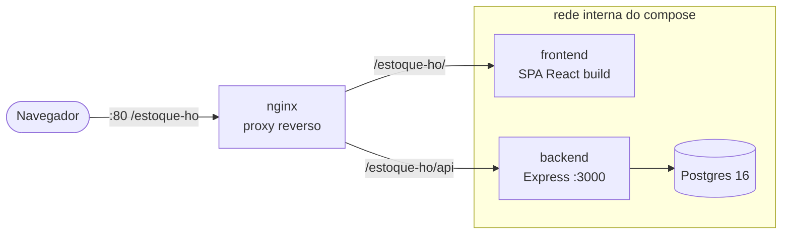

# Infraestrutura & Implantação

A aplicação é empacotada em **quatro containers** orquestrados por Docker Compose,
projetados para rodar tanto localmente quanto no servidor compartilhado do CIn
(`clinicasdigitais.cin.ufpe.br`), sob o subcaminho `/estoque-ho`.

Decisão registrada em [ADR-0010](../adr/ADR-0010.md). Procedimento completo em
[`projeto/DEPLOY.md`](https://github.com/lacavaalex/Controle-de-Estoque-CEO/blob/develop/projeto/DEPLOY.md).

## Arquitetura de implantação



Apenas o **nginx** publica porta no host (`:80`). O **backend** e o **Postgres**
ficam na rede interna do compose, **sem porta exposta** — só são alcançáveis
através do proxy. Isso reduz a superfície de ataque: o banco nunca fica acessível
de fora.

## Os quatro serviços

| Container | Imagem / base | Papel | Porta no host |
|-----------|---------------|-------|:-------------:|
| **nginx** | `nginx:1.27-alpine` | Proxy reverso; serve o front e roteia `/api` | **80** |
| **frontend** | build Vite servido por Nginx | SPA estática (React) | — (interna) |
| **backend** | Node (multi-stage) | API Express | — (interna) |
| **db** | `postgres:16-alpine` | Banco, com volume persistente | — (interna) |

## Subir a stack completa

```bash
cd projeto
docker compose up -d --build
```

Aplicação em **`http://localhost/estoque-ho/`**; a API entra por
`http://localhost/estoque-ho/api`.

| Comando | Efeito |
|---------|--------|
| `docker compose up -d --build` | Sobe (e reconstrói) os 4 containers. |
| `docker compose down` | Para tudo, **mantém** o volume do banco. |
| `docker compose down -v` | Para tudo e **apaga** o volume do Postgres. |

## Comunicação entre serviços

- O **frontend** é construído com `APP_BASE=/estoque-ho/` e
  `VITE_API_BASE=/estoque-ho/api` (build args), então o React Router e o cliente
  de API já sabem o subcaminho.
- O **backend** alcança o banco pelo host interno `db:5432` (nome do serviço na
  rede do compose).
- O **nginx** encaminha `/estoque-ho/` para o front e `/estoque-ho/api` para o
  backend.

## Replicar para outra clínica

Por ser modular, trocar o subcaminho `estoque-ho` por outro nome em **três
lugares** (build args do front no compose, `frontend/nginx.conf` e
`deploy/nginx/estoque-ho.conf`) basta para hospedar outra instância no mesmo
domínio — coerente com a tese de **célula-piloto replicável** do projeto.

## Segredos em produção

Os defaults do `docker-compose.yml` são explicitamente inseguros
("troque-este-segredo-em-producao"). Em produção, crie um `.env` ao lado do
compose sobrescrevendo o que for sensível:

```env
POSTGRES_PASSWORD=...
JWT_SECRET=...
AGENTE_TOKEN=...
SEED_ON_BOOT=false
```

!!! warning "Estado atual da implantação (entrega)"
    A stack está **construída e validada localmente**, porém **ainda não publicada**
    no servidor do CIn — o deploy real depende de acesso ao servidor/TI. O caminho
    está documentado e é essencialmente *um comando* (`docker compose up`) mais o
    ajuste dos `proxy_pass` aos hosts da VM. A demonstração da entrega roda a stack
    **localmente**.
