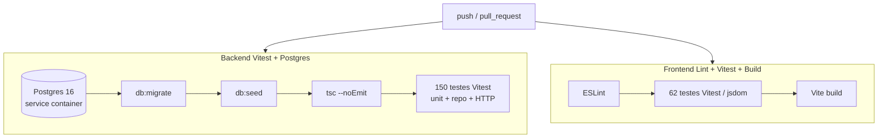

# Integração Contínua (CI)

A cada **push** e a cada **Pull Request**, o GitHub Actions executa
automaticamente a suíte de testes do projeto. Um PR só fica **verde** se tudo
passar — é a rede de segurança automatizada que complementa o *code review*
humano.

Workflow: [`.github/workflows/ci.yml`](https://github.com/lacavaalex/Controle-de-Estoque-CEO/blob/develop/.github/workflows/ci.yml).

## O que roda

### Job `backend`

Como os testes do backend exercitam o banco de verdade (não há mock de
PostgreSQL), o runner sobe um **Postgres 16 efêmero** como *service container* —
a mesma versão maior usada em produção. Em seguida:

1. `npm ci` — instala dependências de forma reprodutível.
2. `npm run db:migrate` — aplica as migrations do Drizzle.
3. `npm run db:seed` — popula os dados de teste (idempotente). **Também é
   pré-requisito dos testes de HTTP**, que logam com os usuários do seed.
4. `npx tsc --noEmit` — verificação de tipos.
5. `npm test -- --run` — os **150 testes** do Vitest (unitários de domínio,
   de repositório contra o Postgres, e de **HTTP/ponta-a-ponta** via supertest).

### Job `frontend`

1. `npm ci` — instala dependências de forma reprodutível.
2. `npm run lint` — ESLint (falha o PR em erros de lint).
3. `npm test` — os **62 testes** (Vitest + Testing Library, em jsdom), sem banco.
4. `npm run build` — build de produção do Vite (falha o PR se a compilação quebrar).

## Decisões de projeto do CI

- **Node 22** nos dois jobs — alinhado ao `@types/node ^25` do projeto, evitando
  divergência de tipos entre o ambiente local e o runner.
- **Segredos de teste** (`JWT_SECRET`, `AGENTE_TOKEN`) são valores fixos só do CI,
  nunca de produção.
- **`concurrency` com `cancel-in-progress`** — um push novo cancela a execução
  anterior do mesmo branch, economizando runners.

!!! success "Evidência de execução"
    O resultado de cada execução fica visível na aba **Actions** do repositório e
    nos *checks* de cada Pull Request — a evidência de que os 212 testes passam de
    forma automatizada, e não apenas na máquina de um desenvolvedor.

## Bloquear o merge (Branch Protection)

A CI verde é, por padrão, **informativa**: o GitHub mostra o check no PR, mas
não impede o merge se ele estiver vermelho. Para tornar a CI **obrigatória** —
ou seja, um PR só pode ser mesclado em `main`/`develop` depois que os jobs
`backend` e `frontend` passarem — é preciso ativar **Branch Protection**:

1. **Settings → Branches → Add branch ruleset** (ou *Add rule*).
2. Branch name pattern: `main` (repita para `develop`).
3. Marque **Require status checks to pass before merging** e selecione os checks
   `Backend (Vitest + Postgres)` e `Frontend (Lint + Vitest + Build)`.
4. (Recomendado) **Require a pull request before merging** e
   **Require branches to be up to date before merging**.

!!! warning "Requer admin"
    Branch Protection só pode ser configurada por quem tem permissão **Admin** no
    repositório (o dono, `lacavaalex`). Não dá para ativar via push/PR — é um
    ajuste único nas configurações do GitHub.

## Relação com a estratégia de qualidade

| Camada | Ferramenta | Quando |
|--------|-----------|--------|
| Testes unitários e de integração | Vitest (backend + frontend) | Local e no CI |
| Testes de HTTP / ponta-a-ponta | Vitest + supertest (backend) | Local e no CI |
| Verificação de tipos | TypeScript (`tsc`) | Local e no CI |
| Lint | ESLint (frontend) | Local e no CI |
| Build de produção | Vite (frontend) | No CI |
| Revisão de código (lógica) | `/code-review` assistido + revisão humana no PR | Antes do merge |
| Revisão de UI (design) | Hook *Impeccable* | A cada edição de frontend |

Ver também: [como testar localmente](como-testar.md) e
[ADR-0011 — IA no fluxo de trabalho](../adr/ADR-0011.md).
