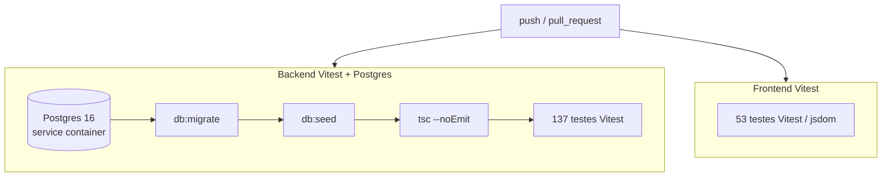

# Integração Contínua (CI)

A cada **push** e a cada **Pull Request**, o GitHub Actions executa
automaticamente a suíte de testes do projeto. Um PR só fica **verde** se tudo
passar — é a rede de segurança automatizada que complementa o *code review*
humano.

Workflow: [`.github/workflows/ci.yml`](https://github.com/lacavaalex/Controle-de-Estoque-CEO/blob/develop/.github/workflows/ci.yml).

## O que roda

### Job `backend`

Como os testes do backend exercitam o banco de verdade (não há mock de
PostgreSQL), o runner sobe um **Postgres 16 efêmero** como *service container* —
a mesma versão maior usada em produção. Em seguida:

1. `npm ci` — instala dependências de forma reprodutível.
2. `npm run db:migrate` — aplica as migrations do Drizzle.
3. `npm run db:seed` — popula os dados de teste (idempotente).
4. `npx tsc --noEmit` — verificação de tipos.
5. `npm test -- --run` — os **137 testes** do Vitest.

### Job `frontend`

`npm ci` e `npm test` — os **53 testes** (Vitest + Testing Library, em jsdom),
sem dependência de banco.

## Decisões de projeto do CI

- **Node 22** nos dois jobs — alinhado ao `@types/node ^25` do projeto, evitando
  divergência de tipos entre o ambiente local e o runner.
- **Segredos de teste** (`JWT_SECRET`, `AGENTE_TOKEN`) são valores fixos só do CI,
  nunca de produção.
- **`concurrency` com `cancel-in-progress`** — um push novo cancela a execução
  anterior do mesmo branch, economizando runners.

!!! success "Evidência de execução"
    O resultado de cada execução fica visível na aba **Actions** do repositório e
    nos *checks* de cada Pull Request — a evidência de que os 190 testes passam de
    forma automatizada, e não apenas na máquina de um desenvolvedor.

## Relação com a estratégia de qualidade

| Camada | Ferramenta | Quando |
|--------|-----------|--------|
| Testes unitários e de integração | Vitest (backend + frontend) | Local e no CI |
| Verificação de tipos | TypeScript (`tsc`) | Local e no CI |
| Revisão de código (lógica) | `/code-review` assistido + revisão humana no PR | Antes do merge |
| Revisão de UI (design) | Hook *Impeccable* | A cada edição de frontend |

Ver também: [como testar localmente](como-testar.md) e
[ADR-0011 — IA no fluxo de trabalho](../adr/ADR-0011.md).
